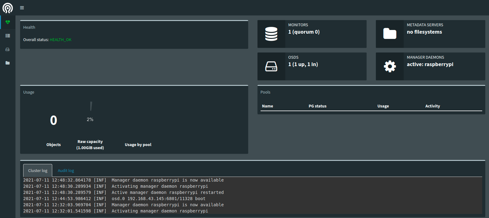

# Ceph在树莓派集群上的部署

## 什么是Ceph

## 如何在树莓派3B+集群上部署Ceph

### 单机版部署

raspbian OS

buster(Debian 10)

ceph-deploy

1. 添加源与安装

修改`hostname`

```
sudo vi /etc/hostname
```

```sudo shutdown -r now```

配置源

```
sudo sed -i 's|raspbian.raspberrypi.org|mirrors.ustc.edu.cn/raspbian|g' /etc/apt/sources.list
```

下载`openssh-server`和`ntp`

下面我们将`ceph-stable-release`替换为`pacific`

```
wget -q -O- 'https://download.ceph.com/keys/release.asc' | sudo apt-key add -
echo deb https://download.ceph.com/debian-{ceph-stable-release}/ $(lsb_release -sc) main | sudo tee /etc/apt/sources.list.d/ceph.list
```

然后安装

```
sudo apt update
sudo apt install ceph-deploy
```

切换到root用户

```
sudo -i
```

2. 安装ceph软件包


**注意**，下面的`<hostname>`都要替换为pi机的hostname，一般为`raspberrypi`，具体看bash提示符的`user@hostname`这里可以看出来，或者自行搜索hostname查看方法(可设置hostname)

可以通过修改`/etc/hostname`修改成你想修改的hostname

首先要替换hosts，这里通过在`/etc/hosts`添加ip以及hostname可做到
```
sudo vim /etc/hosts
```
在之后添加树莓派`ip`以及树莓派的`hostname`，例如

```
192.168.43.145      raspberrypi
```

接着创建文件夹，之后一般都在新创建的文件夹下工作

```
mkdir test
cd test
ceph-deploy new <hostname>(raspberrypi)
```

然后在`ceph.conf`文件末尾添加

```
osd pool default size = 1
osd pool default min size = 1
```

然后安装ceph软件

```
ceph-deploy install --release luminous <hostname>(raspberrypi)
```

然后是初始化monitor

```
ceph-deploy mon create-initial
ceph-deploy admin <hostname>(raspberrypi)
```

然后可以通过`ceph -s`查看集群状态

接着部署`ceph mgr` manager

```
ceph-deploy mgr create <hostname>(raspberrypi)
```

然后是部署`ceph osd`，这里需要安装`lvm2`

```
# pvcreate /dev/sdb

(效果)  Physical volume "/dev/sdb" successfully created.

# vgcreate  ceph-pool /dev/sdb

  Volume group "ceph-pool" successfully created

# lvcreate -n osd0.wal -L 1G ceph-pool

  Logical volume "osd0.wal" created.
  
# lvcreate -n osd0.db -L 1G ceph-pool

  Logical volume "osd0.db" created.
  
# lvcreate -n osd0 -l 100%FREE ceph-pool

  Logical volume "osd0" created.

```

```
ceph-deploy osd create \
    --data ceph-pool/osd0 \
    --block-db ceph-pool/osd0.db \
    --block-wal ceph-pool/osd0.wal \
    --bluestore <hostname>(raspberrypi)
```

然后开启`mgr`的`dashboard`模块

```
ceph mgr module enable dashboard
```

通过一下命令，以及浏览器，你就可以拥有图形化界面观察集群现状了

```
ceph mgr services
```

一般来说效果是

```
root@raspberrypi:~/test# ceph mgr services
{
    "dashboard": "http://raspberrypi:7000/"
}
```

在浏览器上输入`<树莓派ip>:7000`即可观察效果



### reference

1. [Linux中国部署方案](https://linux.cn/article-13020-1.html)
2. [树莓派无网线无鼠标无键盘安装系统并连接到网络](https://segmentfault.com/a/1190000010976507)
3. [树莓派设置无密码](https://blog.csdn.net/sinat_37842336/article/details/108042269)
4. [树莓派设置开启自动连接WiFi功能](https://blog.csdn.net/blueisman/article/details/103237934)
5. [设置Hosts，本机回环路径](https://blog.csdn.net/weixin_34314962/article/details/91916877)
6. [pvcreate](https://blog.csdn.net/weixin_34177064/article/details/91561425)
7. [centos部署五步骤](https://blog.csdn.net/weixin_43860781)
8. [文件系统](https://www.zhihu.com/search?type=content&q=ceph-deploy%E6%96%87%E4%BB%B6%E7%B3%BB%E7%BB%9F)
9. [单机版部署](https://zhuanlan.zhihu.com/p/67832892)
10. [网页版gui(在文章最后)](https://zhuanlan.zhihu.com/p/331770823)
11. [创建pool以及测试](https://blog.csdn.net/haohzhang/article/details/86589381)


单机版

30s

| PGs | Bandwidth |
| --- | --------- |
| 64  | 0.82      |
| 128 | 0.99      |
| 200 | 0.87      |
| 256 | 1.01      |

10s
| PGs | Bandwidth |
| --- | --------- |
| 32  | 1.022     |
| 64  | 0.911     |
| 128 | 0.858     |
| 256 | 0.720     |

### 多节点

修改`hostname`

```
sudo vim /etc/hostname
```

同时还要修改`/etc/hosts`文件

对于admin节点

加入
```
<ip> node1
<ip> node2
<ip> node3
```

对于其他节点，要将`raspberrypi`改成`node<x>`

```
127.0.0.1 node<x>(原本为raspberrypi)
```

对每个节点配置源

```
sudo sed -i 's|raspbian.raspberrypi.org|mirrors.ustc.edu.cn/raspbian|g' /etc/apt/sources.list
```

下载`openssh-server`和`ntp`

在每个节点创建`test`用户

```
ssh pi@node{x}
sudo useradd -d /home/test -m test
sudo passwd test
echo "test ALL = (root) NOPASSWD:ALL" | sudo tee /etc/sudoers.d/test
sudo chmod 0440 /etc/sudoers.d/test 
```

> 上面代码块中的后面两步让test用户拥有sudo权限

在管理节点(admin)生成sshkey

```
ssh-keygen
```

然后拷贝到各节点

```
ssh-copy-id test@node1
ssh-copy-id test@node2
ssh-copy-id test@node3
```

然后节点之间可以相互ping一下，保证网络通畅

接着开始部署

选择node1为admin,node2为monitor,node3为osd

在node1节点

```
mkdir my_cluster
cd my_cluster
```

在以下步骤中若遇到麻烦，一定要执行下面两种操作

```
ceph-deploy purgedata node1 node2 ...
ceph-deploy forgetkeys
```
> 这个为purge数据，忘记钥匙

```
ceph-deploy purge node1 node2 ...
```
> 这个会把安装好的ceph-common等也卸载掉，尽量少用

然后创建monitor(mon)

```
ceph-deploy new node2
```

现在，node2就是monitor了

然后还是在node1(admin)上将`ceph.conf`文件修改(该文件在`my-cluster`文件夹下)

加入

```
osd pool default size = 2
public network = {ip-address}/{netmask}(一般为node1 ip/24)
```

然后运行如下指令在各节点安装ceph

```
ceph-deploy install node1 node2 node3
```

然后还是在node1节点初始化monitor

```
ceph-deploy mon create-initial
```

创建完之后在`my-cluster`文件夹下应该有`ceph.client.admin.keyring`,`ceph.bootstrap-osd.keyring`,`ceph.bootstrap-mds.keyring`,`ceph.bootstrap-rgw.keyring`

然后是添加osd，这里我们在node1, node3下创建

```
ssh node1
sudo mkdir /var/local/osd0
```